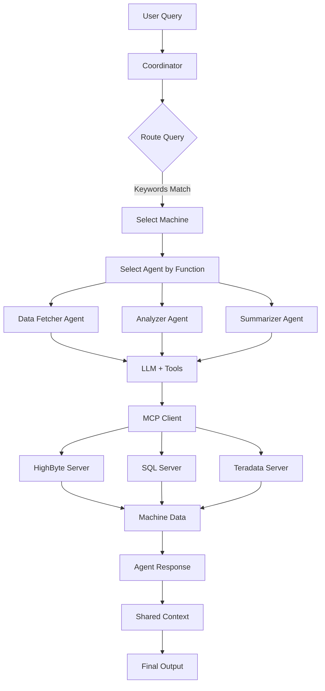

# Multi-Agent Framework: Usage Breakdown

## How the Configuration Architecture Works

### Core Concept: One Config Per Deployment/Persona

Each YAML configuration file defines a **complete deployment** for a specific use case. You would have:

- **`spar_lamination_config.yaml`** - All agents and tools for Spar Lamination machine
- **`robot_a_config.yaml`** - All agents and tools for Robot A
- **`quality_control_config.yaml`** - Different agents/tools for quality perspective

Each deployment runs as a **separate instance** of the framework.

## Example 1: Spar Lamination Machine Configuration

```yaml
# spar_lamination_config.yaml

llm_providers:
  openai_standard:
    type: "openai"
    api_key: "${OPENAI_API_KEY}"
    default_model: "gpt-4o-mini"

default_llm_provider: "openai_standard"

agents:
  # Data Fetcher - Gets current machine data
  - agent_id: "spar_lam_data_fetcher"
    name: "Spar Lamination Data Fetcher"
    machine_id: "spar_lamination_machine"  # ← Machine-specific
    function: "data_fetching"
    capabilities:
      - "fetch_current_status"
      - "retrieve_sensor_data"
    mcp_tools:
      - server: "highbyte"
        tools:
          - "get_spar_lam_robot_status"      # ← Spar-specific tool
          - "get_spar_lam_process_data"      # ← Spar-specific tool
      - server: "sql_local"
        tools:
          - "query_spar_lam_logs"            # ← Spar-specific query
    model: "gpt-4o-mini"

  # Analyzer - Analyzes Spar Lam data
  - agent_id: "spar_lam_analyzer"
    name: "Spar Lamination Analyzer"
    machine_id: "spar_lamination_machine"
    function: "analysis"
    mcp_tools:
      - server: "teradata"
        tools:
          - "teradata_spar_lam_stats"        # ← Spar-specific analytics
          - "teradata_spar_lam_quality"      # ← Spar-specific metrics
    model: "gpt-4"

  # Summarizer
  - agent_id: "spar_lam_summarizer"
    name: "Spar Lamination Summarizer"
    machine_id: "spar_lamination_machine"
    function: "summary"
    mcp_tools: []
    model: "gpt-4o-mini"

routing_examples:
  - keywords: ["spar lamination", "spar lam"]
    machine_id: "spar_lamination_machine"

mcp_servers:
  highbyte:
    endpoint: "http://highbyte-server/spar-lam"  # ← Points to Spar Lam data
  sql_local:
    connection_string: "mssql://localhost/SparLamDB"
  teradata:
    connection_string: "teradata://tdserver/spar_analytics"
```

## Example 2: Different Machine - Robot A Configuration

```yaml
# robot_a_config.yaml

llm_providers:
  openai_standard:
    type: "openai"
    api_key: "${OPENAI_API_KEY}"
    default_model: "gpt-4o-mini"

default_llm_provider: "openai_standard"

agents:
  # Data Fetcher for Robot A
  - agent_id: "robot_a_data_fetcher"
    name: "Robot A Data Fetcher"
    machine_id: "robot_a"                    # ← Different machine!
    function: "data_fetching"
    capabilities:
      - "fetch_robot_position"
      - "retrieve_arm_metrics"
    mcp_tools:
      - server: "highbyte"
        tools:
          - "get_robot_a_position"           # ← Robot A specific tools
          - "get_robot_a_torque_data"        # ← Different from Spar Lam
      - server: "sql_local"
        tools:
          - "query_robot_a_movements"        # ← Robot A specific query
    model: "gpt-4o-mini"

  # Analyzer for Robot A
  - agent_id: "robot_a_analyzer"
    name: "Robot A Analyzer"
    machine_id: "robot_a"
    function: "analysis"
    mcp_tools:
      - server: "teradata"
        tools:
          - "teradata_robot_a_efficiency"    # ← Robot A analytics
          - "teradata_robot_a_collisions"    # ← Different metrics
    model: "gpt-4"

  # Summarizer for Robot A
  - agent_id: "robot_a_summarizer"
    name: "Robot A Summarizer"
    machine_id: "robot_a"
    function: "summary"
    mcp_tools: []
    model: "gpt-4o-mini"

routing_examples:
  - keywords: ["robot a", "robot-a", "robotic arm"]
    machine_id: "robot_a"

mcp_servers:
  highbyte:
    endpoint: "http://highbyte-server/robot-a"  # ← Different endpoint!
  sql_local:
    connection_string: "mssql://localhost/RobotDB"
  teradata:
    connection_string: "teradata://tdserver/robot_analytics"
```

## How It Works: Step-by-Step

### 1. Tool Specialization

Each agent only sees **its allowed tools**:

```python
# Spar Lam Data Fetcher can ONLY call:
- get_spar_lam_robot_status
- get_spar_lam_process_data
- query_spar_lam_logs

# Robot A Data Fetcher can ONLY call:
- get_robot_a_position
- get_robot_a_torque_data
- query_robot_a_movements
```

The framework **enforces** this at runtime - agents get permission errors if they try to use tools not in their list.

### 2. LLM Function Calling Integration

When an agent executes a task, here's what happens:

```
User Query: "What's the status of the spar lamination machine?"
    ↓
Coordinator routes to: "spar_lam_data_fetcher"
    ↓
Agent builds LLM prompt with:
  - System: "You are Spar Lamination Data Fetcher..."
  - User: "Fetch the status..."
  - Tools available: [get_spar_lam_robot_status, get_spar_lam_process_data]
    ↓
LLM decides: "I should call get_spar_lam_robot_status"
    ↓
Agent executes: mcp_client.call_tool("get_spar_lam_robot_status", {})
    ↓
HighByte returns: {"status": "running", "speed": 95, ...}
    ↓
LLM receives result and formats response
    ↓
Agent returns formatted answer
```

### 3. Running Different Deployments

You would run different instances:

```bash
# Equipment Engineer for Spar Lamination
python demo.py --config spar_lamination_config.yaml

# Equipment Engineer for Robot A  
python demo.py --config robot_a_config.yaml

# Quality Engineer (different persona, same machine)
python demo.py --config quality_spar_lam_config.yaml
```

Each runs independently with its own:
- Agents specialized for that machine
- Tools pointing to that machine's data
- Custom instructions relevant to that context

## Complete Architecture Diagram

```
┌─────────────────────────────────────────────────────────────┐
│  Spar Lamination Deployment (spar_lamination_config.yaml)  │
├─────────────────────────────────────────────────────────────┤
│                                                              │
│  LLM Provider: OpenAI gpt-4o-mini                           │
│                                                              │
│  Agents:                                                     │
│  ┌────────────────────┐  ┌───────────────────┐             │
│  │ Data Fetcher       │  │ Analyzer          │             │
│  │ Tools:             │  │ Tools:            │             │
│  │ - spar_lam_status  │  │ - spar_lam_stats  │             │
│  │ - spar_lam_sensors │  │ - spar_lam_trends │             │
│  └────────────────────┘  └───────────────────┘             │
│           ↓                       ↓                         │
│  ┌──────────────────────────────────────────┐              │
│  │ MCP Servers                               │              │
│  │ - HighByte → Spar Lam endpoint           │              │
│  │ - SQL → SparLamDB                        │              │
│  │ - Teradata → spar_analytics              │              │
│  └──────────────────────────────────────────┘              │
└─────────────────────────────────────────────────────────────┘

┌─────────────────────────────────────────────────────────────┐
│       Robot A Deployment (robot_a_config.yaml)              │
├─────────────────────────────────────────────────────────────┤
│                                                              │
│  LLM Provider: OpenAI gpt-4o-mini                           │
│                                                              │
│  Agents:                                                     │
│  ┌────────────────────┐  ┌───────────────────┐             │
│  │ Data Fetcher       │  │ Analyzer          │             │
│  │ Tools:             │  │ Tools:            │             │
│  │ - robot_a_position │  │ - robot_a_metrics │             │
│  │ - robot_a_torque   │  │ - robot_a_faults  │             │
│  └────────────────────┘  └───────────────────┘             │
│           ↓                       ↓                         │
│  ┌──────────────────────────────────────────┐              │
│  │ MCP Servers                               │              │
│  │ - HighByte → Robot A endpoint            │              │
│  │ - SQL → RobotDB                          │              │
│  │ - Teradata → robot_analytics             │              │
│  └──────────────────────────────────────────┘              │
└─────────────────────────────────────────────────────────────┘
```

## Workflow Visualization



## Key Benefits

### 1. Isolation
Each machine's agents can't accidentally call wrong tools. The framework enforces tool permissions at runtime.

### 2. Specialization
Agents know exactly what machine they're working with. Their system prompts, capabilities, and tools are all machine-specific.

### 3. Clarity
Clear separation prevents confusion. You can't accidentally query Robot A's database when asking about Spar Lamination.

### 4. Scalability
Add new machines by creating new config files. No code changes needed - just YAML configuration.

### 5. Flexibility
Same framework, different configurations. The code is reusable, only the config changes.

## Real-World Usage Patterns

### Pattern 1: Multiple Machines, Single Persona

**Use Case**: Equipment Engineer responsible for multiple machines

```bash
# Separate deployments for each machine
python demo.py --config spar_lamination_config.yaml
python demo.py --config robot_a_config.yaml
python demo.py --config conveyor_belt_config.yaml
```

### Pattern 2: Single Machine, Multiple Personas

**Use Case**: Different roles need different views of the same machine

```bash
# Equipment Engineer view - troubleshooting and maintenance
python demo.py --config spar_lam_equipment_config.yaml

# Quality Engineer view - quality metrics and compliance
python demo.py --config spar_lam_quality_config.yaml

# Production Manager view - efficiency and output
python demo.py --config spar_lam_production_config.yaml
```

### Pattern 3: Hybrid Deployments

**Use Case**: Department-specific deployments with multiple machines

```bash
# Assembly department - multiple assembly machines
python demo.py --config assembly_dept_config.yaml

# Quality control - quality tools across all machines
python demo.py --config quality_dept_config.yaml
```

## Configuration Best Practices

### 1. Naming Conventions

```yaml
# Machine-specific agent IDs
agent_id: "spar_lam_data_fetcher"  # Good
agent_id: "data_fetcher"           # Bad - not specific

# Tool naming
tools:
  - "get_spar_lam_status"  # Good - clear which machine
  - "get_status"           # Bad - ambiguous
```

### 2. Tool Organization

Group tools by server and purpose:

```yaml
mcp_tools:
  - server: "highbyte"
    tools:
      - "get_spar_lam_robot_status"
      - "get_spar_lam_process_data"
  - server: "sql_local"
    tools:
      - "query_spar_lam_logs"
      - "get_spar_lam_error_history"
```

### 3. Custom Instructions

Make instructions machine and function-specific:

```yaml
custom_instructions: |
  You are a data fetching agent for the Spar Lamination machine.
  Focus on retrieving current operational data. When asked about 
  status, always check both robot status and process data.
  Report any anomalies immediately.
```

### 4. Model Selection

Choose appropriate models for each agent:

```yaml
agents:
  - agent_id: "data_fetcher"
    model: "gpt-4o-mini"      # Fast, cheap for simple data fetching
  
  - agent_id: "analyzer"
    model: "gpt-4"            # More powerful for complex analysis
  
  - agent_id: "summarizer"
    model: "gpt-4o-mini"      # Fast for formatting
```

## Summary

**Yes!** Each YAML config is:
- ✅ Specialized to a single machine (or group of machines)
- ✅ Has specific tools only for that machine
- ✅ Can be deployed independently
- ✅ Completely isolated from other deployments

You can have as many configs as you need - one per machine, one per persona, or any combination that makes sense for your organization!

## Next Steps

1. **Create Your First Machine Config**: Start with one machine you know well
2. **Define Machine-Specific Tools**: List all the data sources and operations
3. **Set Up MCP Servers**: Configure connections to your data sources
4. **Test with Mock Mode**: Use `test_config_simple.yaml` as a template
5. **Add Real Tools**: Integrate actual MCP servers when ready
6. **Scale Up**: Add more machines and personas as needed
